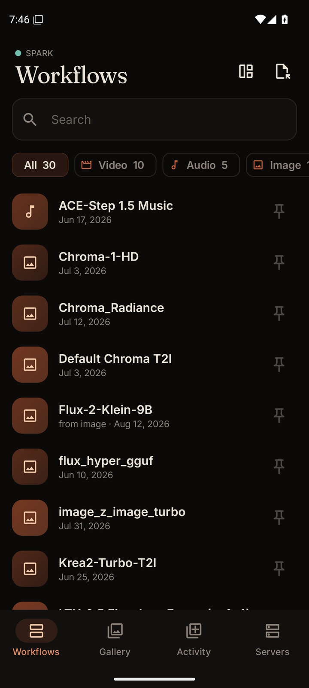
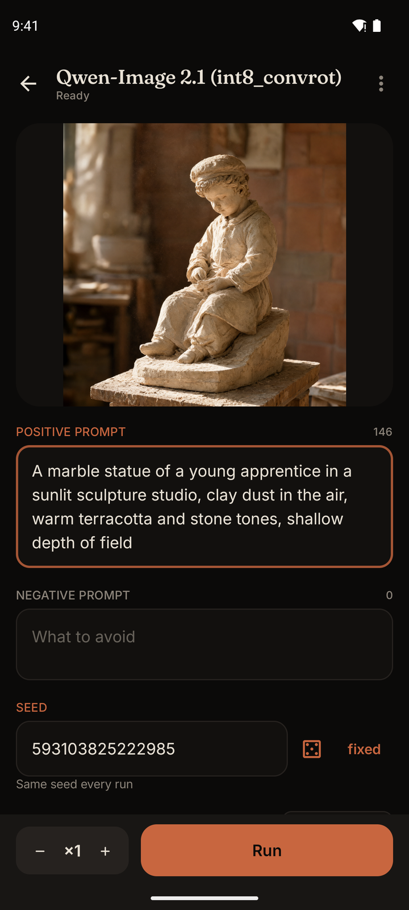
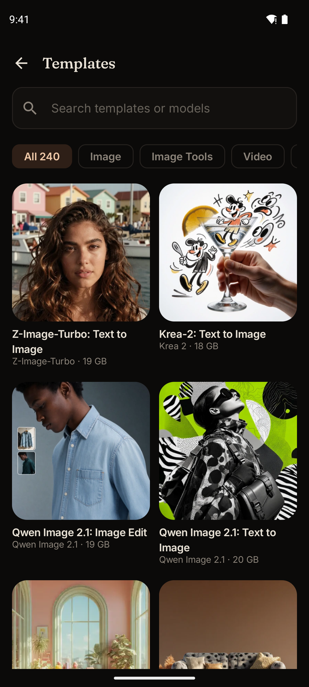
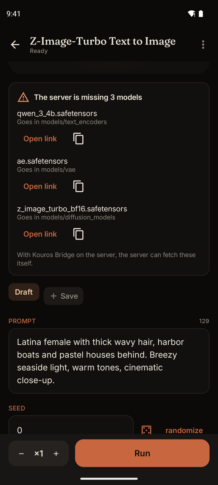
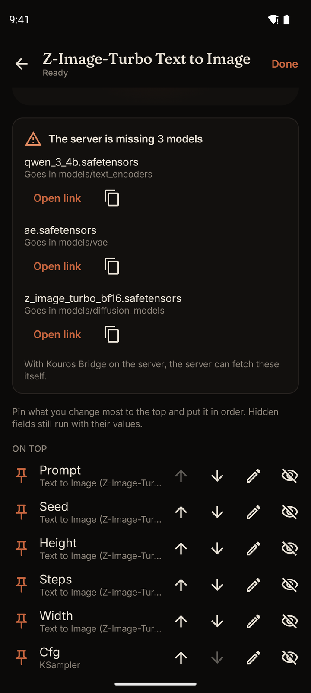
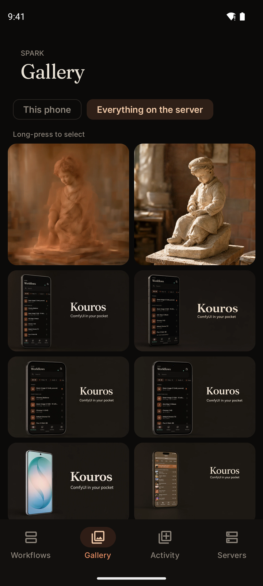
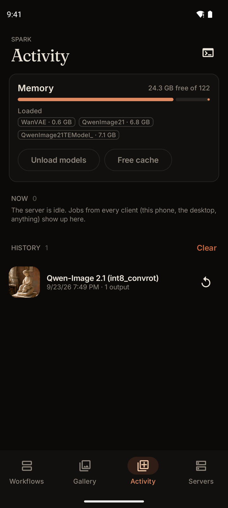

# Kouros

A native Android app for running [ComfyUI](https://github.com/comfyanonymous/ComfyUI) from your
phone. Open any workflow saved on your server, get a clean form for the parts that matter, queue
it, and follow it live — in the notification, on the lock screen, anywhere — until the result
lands in your gallery.

<p>
  
  
  
  
</p>

## Install

Grab the latest APK from [Releases](https://github.com/CocaKova/kouros/releases) and open it on
your phone (Android 8 or newer). Updates install over the top and keep your servers. To get
updates automatically, add the repo to [Obtainium](https://github.com/ImranR98/Obtainium).

Coming from a 0.x pre-release? Uninstall it first: those were signed with a development key.

Then add your server under **Servers**. Kouros needs to reach ComfyUI's port, so keep it on your
home network, a VPN such as Tailscale, or behind a proxy with authentication. ComfyUI has no
password of its own, so never forward its port to the internet.

## What makes it different

- **Any workflow, as it is.** Subgraphs, bypassed and muted nodes, reroutes, primitive nodes,
  dynamic inputs — Kouros compiles saved workflows the same way the ComfyUI frontend does, and
  is tested against the frontend's own output on hundreds of real workflows (see
  [`tools/golden`](tools/golden/README.md)). When a workflow needs something only the desktop can
  compute, it says so instead of guessing.
- **Nothing hard-coded.** Every node is understood through what your server reports about it
  (`/object_info`). Node packs, models and custom nodes are yours; the app adapts to them.
- **Built for a phone.** Background-safe progress, reconnects that never lose a run, previews in
  the notification, and a gallery of everything you made.
- **Start from nothing.** A new server has no saved workflows, so Kouros opens its template
  gallery. Add a template and the form tells you which models are missing, where each one goes and
  where to get it.
- **Your form, your way.** Pin the fields you change most to the top, reorder, rename or hide them,
  and save sets of values as presets.
- **Reference photos.** Workflows that can take more images get free slots for them, wired in
  for you.
- **Runs the server too.** Every client's queue and history, live logs, the model folders, and
  unload/free-memory buttons that tell you what they gave back.
- **Prompt helper.** Point it at any OpenAI-compatible endpoint, local or hosted, and it rewrites
  a prompt for the workflow in front of you.

## Kouros Bridge (optional)

A small ComfyUI extension in [`bridge/`](bridge/README.md) (MIT). With it, deleting in the app
removes the files from disk, the memory panel shows exactly which models are loaded, and the
server can download a workflow's missing models straight into the right folder.

<p>
  
  
  
</p>

## Building

Requires JDK 17 and the Android SDK (API 36).

```sh
./gradlew :core:jvmTest        # protocol, compiler and golden corpus
./gradlew :app:assembleFossDebug
```

`tools/ship.sh` runs tests and assembles in one go, and can hand the build to another machine
(see `tools/remote-ship.sh`).

## Changelog

See [CHANGELOG.md](CHANGELOG.md).

## Authorship

Kouros is written and maintained solely by [CocaKova](https://github.com/CocaKova).

## License

[PolyForm Noncommercial 1.0.0](LICENSE). Free for personal and other noncommercial use;
commercial use is reserved to the author.

Bundled fonts: [Fraunces](licenses/Fraunces-OFL.txt) and [Inter](licenses/Inter-OFL.txt), both
under the SIL Open Font License. The public test corpus is derived from ComfyUI's
[workflow templates](https://github.com/Comfy-Org/workflow_templates), MIT
([notice](licenses/ComfyUI-workflow-templates-MIT.txt)).
