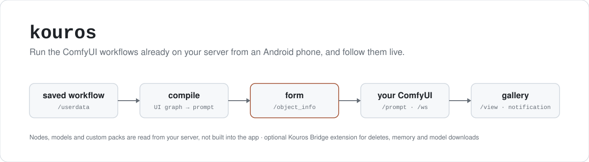
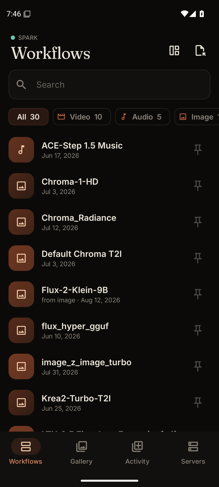
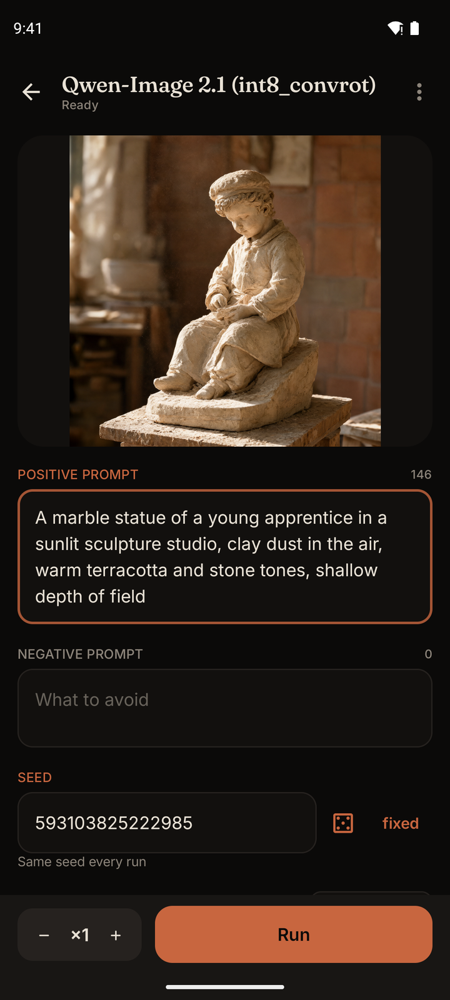
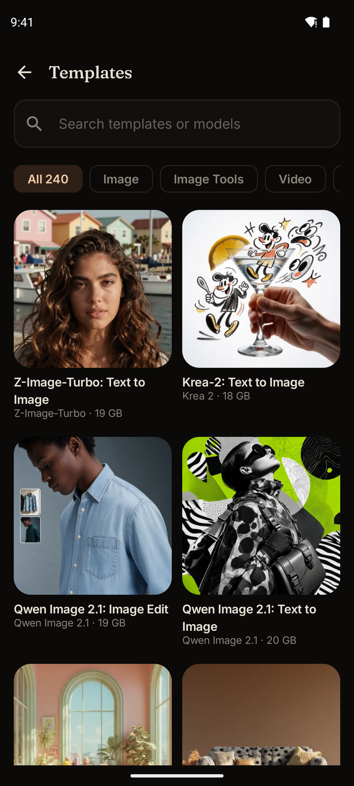
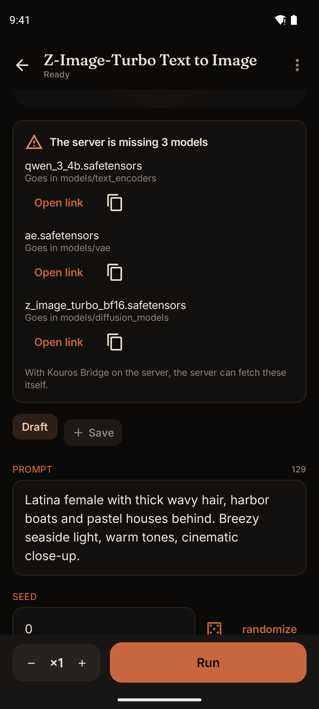
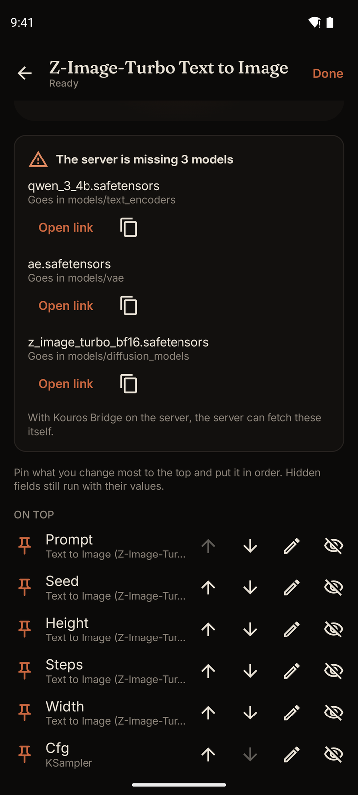
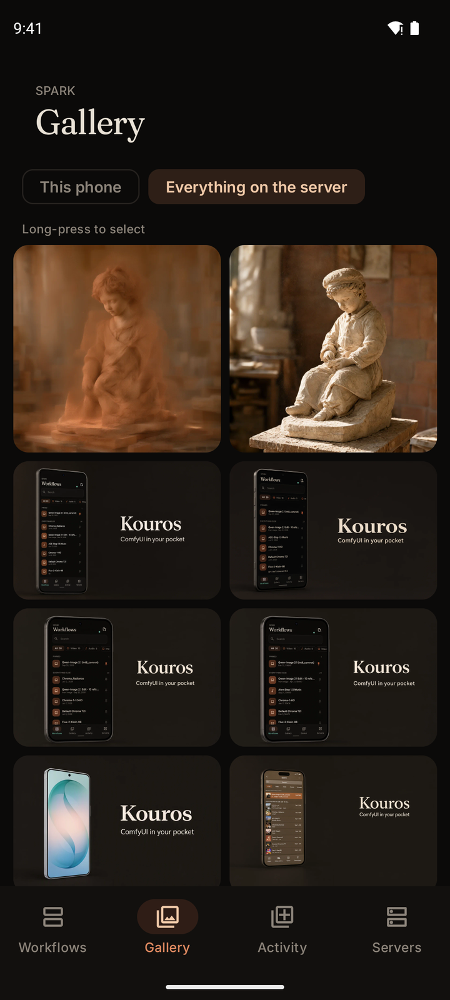
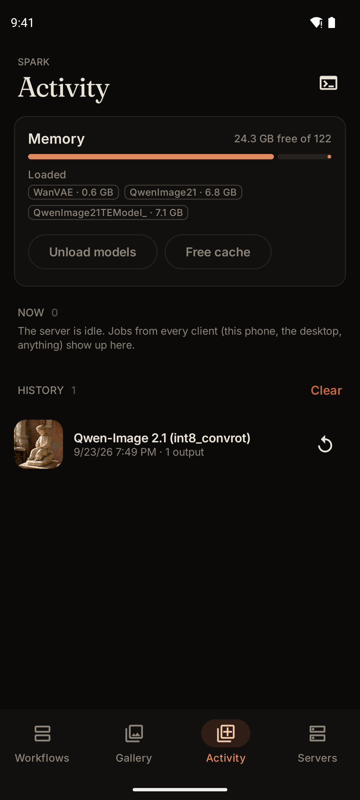

<p align="center">
  <picture>
    <source media="(prefers-color-scheme: dark)" srcset="assets/hero-dark.svg">
    
  </picture>
</p>

<p align="center">
  <a href="https://github.com/CocaKova/kouros/releases/latest"></a>
  
  
  <a href="LICENSE"></a>
  <a href="bridge/LICENSE"></a>
</p>

Kouros is a native Android app for running [ComfyUI](https://github.com/Comfy-Org/ComfyUI)
from your phone. Open any workflow saved on your server and you get a form for the parts you
actually change. Queue it, follow it in the notification while the phone is in your pocket,
and find the result in the gallery. It talks to your own ComfyUI server; nothing goes through a
third-party service unless you set up the optional prompt helper.

Kouros is an independent project. It is not affiliated with or endorsed by ComfyUI or Comfy Org.

## Install

1. Download the APK from [Releases](https://github.com/CocaKova/kouros/releases/latest) and open
   it on your phone (Android 8.0 or newer). Updates install over the top and keep your servers.
   To get updates automatically, add this repo to [Obtainium](https://github.com/ImranR98/Obtainium).
2. Under **Servers**, add your ComfyUI address, for example `http://192.168.1.20:8188`.

Kouros has to reach ComfyUI's port, so keep the server on your home network, behind a VPN such as
Tailscale, or behind a proxy with authentication. ComfyUI has no password of its own: never
forward its port to the internet.

Coming from a 0.x pre-release? Uninstall it first. Those builds were signed with a development
key, so Android won't update over them.

## Screenshots

<p align="center">
  
  
  
  
</p>
<p align="center">
  
  
  
</p>

The screenshots predate the Apps tab.

## Features

| | |
|---|---|
| **Any saved workflow** | Subgraphs, bypassed and muted nodes, reroutes, primitive nodes and dynamic inputs are compiled the way the ComfyUI frontend does it. The compiler is checked against the frontend's own output (see [`tools/golden`](tools/golden/README.md)); the repo ships a public corpus of 63 cases built from ComfyUI's workflow templates. When a workflow needs something only the desktop can compute, Kouros says so instead of guessing. |
| **Nothing hard-coded** | Every node is read from what your server reports (`/object_info`), so your node packs, models and custom nodes work as they are. |
| **Your form** | Pin the fields you change most to the top, reorder, rename or hide them, and save sets of values as presets. Workflows that can take more images get extra reference-photo slots, wired in for you. |
| **Live progress** | A foreground service follows the run over ComfyUI's websocket, with previews in the notification and reconnects that pick the run back up. |
| **Gallery** | Everything the server made, not only what this phone queued. |
| **Templates and missing models** | A new server with no saved workflows opens the template gallery. Add a template and the form lists each missing model, the folder it goes in and where to get it. Templates that need a paid cloud account are left out. |
| **Server tools** | Every client's queue and history, live logs, the model folders, and unload / free-memory buttons that report what they gave back. |
| **Shortcuts** | A Quick Settings tile and a home-screen widget that run the last workflow again with fresh seeds. |
| **Prompt helper** | Point it at any OpenAI-compatible endpoint, local or hosted, and it rewrites a prompt for the workflow in front of you. |

### On `main`, not yet released

The latest release APK is 1.0.0. Everything under 1.0.1 and 1.1.0 in
[CHANGELOG.md](CHANGELOG.md) is on `main` and will be in the next release. The larger pieces:

- **A music player** for audio results, and text outputs shown after the media instead of before it.
- **A gallery grouped** into pictures, audio and notes, opening on the pictures.
- **Pick from the server.** Any image field can take a picture straight from the server's output
  folder, so upscaling the last result needs no upload.
- **A run that stops short says why:** who stopped it, the node it reached, free memory and the
  server's last log lines.
- **Corrected node ranges.** Some nodes declare value ranges their own code refuses (SUPIR's
  seed is the known one); Kouros narrows them where it reads the definitions.
- **Apps**, below.

Apps are one-purpose tools on their own tab: a photo in, a knob or two, a button. **Upscale 4×**
enlarges without diffusion; **SUPIR restore** rebuilds detail as it enlarges. Each card says
what your server is still missing (node pack, model files, gigabytes) and sets it up where it
can: models through the bridge, node packs through ComfyUI-Manager, then a restart. An app is
data in [`apps.json`](app/src/main/assets/apps.json) (a prompt, a form arrangement, a list of
what it needs), not code.

## Configuration

Everything is set in the app; there are no config files.

- **Server address.** `http://` or `https://`, with an optional path prefix for reverse proxies
  (`https://host/comfy`). Plain `http://` is accepted without asking on private networks
  (RFC 1918, Tailscale's 100.64/10, link-local, loopback, IPv6 ULA, `.local` names). Anywhere
  else it needs an explicit opt-in, because prompts and images would cross the internet in the
  clear.
- **Authentication.** None, a bearer token, a user name and password, or a custom header. It is
  sent on every request and on the websocket upgrade. Secrets are stored encrypted on the phone
  and excluded from backups.
- **Power control (optional).** Start, stop and status URLs with a secret header, for a server
  that you switch on and off from somewhere else.
- **Prompt helper (optional).** Endpoint URL, API key and model of any OpenAI-compatible
  `/chat/completions` API.

## Kouros Bridge (optional)

A small ComfyUI extension in [`bridge/`](bridge/README.md), MIT licensed. It adds routes under
`/kouros/` and no nodes, and Kouros detects it on its own. With it:

- deleting in the app removes the files from disk (only in `output/`, `temp/` and `input/kouros/`),
- the memory panel shows which models are loaded and how big they are,
- the server can download a workflow's missing models straight into the right folder.

Without it the app works the same, except that deleting only removes history. Install by
copying or symlinking `bridge/kouros_bridge` into `ComfyUI/custom_nodes/` and restarting
ComfyUI.

## Limitations

- A personal project, tested against the author's own ComfyUI servers and phones. Your node
  packs and devices may find cases it hasn't met. Issues are welcome.
- Some workflows can't be compiled on the phone (the app tells you which). Nodes that declare
  value ranges their own code refuses can still fail a run; on `main`, known ones are corrected
  in `NodeAdapters`.
- Setting up an app's node pack needs [ComfyUI-Manager](https://github.com/Comfy-Org/ComfyUI-Manager)
  on the server; downloading models needs the bridge. Without them the app tells you what to
  install by hand.
- ComfyUI has no authentication. Kouros can send a token or password to a proxy in front of it,
  but it can't make an exposed ComfyUI safe.
- Provided as is, with no warranty beyond what the license says.

## Building

Needs JDK 17 and the Android SDK (API 36).

```sh
./gradlew :core:jvmTest        # protocol, compiler and golden corpus
./gradlew :app:assembleFossDebug
```

`tools/ship.sh` runs the tests and assembles in one go, and can hand the build to another machine
(see `tools/remote-ship.sh`). Release signing reads `kouros.keystore`, `kouros.keystore.password`,
`kouros.key.alias` and `kouros.key.password` from `local.properties`; without them, release
builds fall back to the debug keystore.

## Changelog

See [CHANGELOG.md](CHANGELOG.md).

## Authorship

Kouros is written and maintained solely by [CocaKova](https://github.com/CocaKova).

## License

[PolyForm Noncommercial 1.0.0](LICENSE). Free for personal and other noncommercial use;
commercial use is reserved to the author. The bridge in [`bridge/`](bridge/LICENSE) is MIT.

Bundled fonts: [Fraunces](licenses/Fraunces-OFL.txt) and [Inter](licenses/Inter-OFL.txt), both
under the SIL Open Font License. The public test corpus is derived from ComfyUI's
[workflow templates](https://github.com/Comfy-Org/workflow_templates), MIT
([notice](licenses/ComfyUI-workflow-templates-MIT.txt)).
